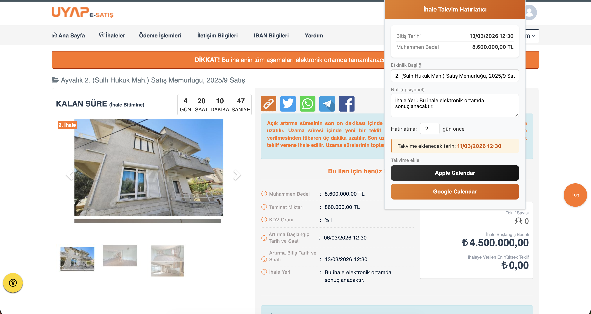
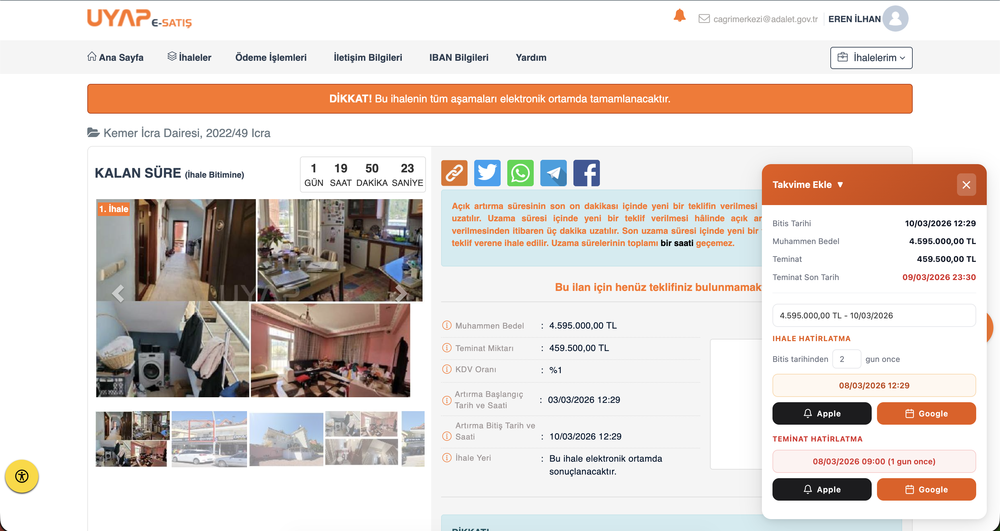

# İhale Takvim Hatırlatıcı - Chrome Eklentisi

UYAP E-Satış portalındaki ihale detay sayfalarından bitiş tarihini otomatik okuyarak, belirlediğiniz gün kadar önce Apple Calendar veya Google Calendar'a hatırlatma etkinliği eklemenizi sağlayan Chrome eklentisi.

## Ekran Görüntüleri





## Özellikler

- İhale detay sayfasında sağ altta otomatik panel açılır
- Sayfadan ihale bitiş tarihi, muhammen bedel, teminat miktarı gibi bilgileri otomatik çeker
- Akıllı etkinlik başlığı: **yer - bedel - tarih** formatında otomatik oluşturulur (ör. `Bursa Banka Alacakları - 714.000,00 TL - 10/03/2026`)
- Kaç gün önce hatırlatma istediğinizi seçebilirsiniz (varsayılan: 2 gün)
- Etkinlik başlığını panelden özelleştirebilirsiniz
- **Teminat hatırlatması**: Teminat yatırma son tarihinden 1 gün önce ayrı hatırlatma oluşturur
- **Apple Calendar** desteği (.ics dosyası ile, 30 dk öncesi alarm dahil)
- **Google Calendar** desteği (tarayıcıda açılır)
- Panel başlığına tıklayarak küçültüp açabilirsiniz

## Kurulum

1. Bu repoyu klonlayın veya indirin
2. Chrome'da `chrome://extensions` adresine gidin
3. Sağ üstten **Geliştirici modu**'nu açın
4. **Paketlenmemiş öğe yükle** butonuna tıklayın
5. İndirdiğiniz klasörü seçin

## Kullanım

1. [UYAP E-Satış](https://esatis.uyap.gov.tr) portalına giriş yapın
2. Herhangi bir ihale detay sayfasını açın
3. Sağ altta **Takvime Ekle** paneli otomatik olarak açılır
4. Başlığı düzenleyin, hatırlatma gün sayısını ayarlayın
5. **Apple Calendar** veya **Google Calendar** butonuna tıklayın
6. Teminat hatırlatması için ayrı butonları kullanın

## Dosya Yapısı

```
ihale/
├── manifest.json    # Chrome extension tanımı
├── content.js       # Sayfadan ihale verisi çeken ve panel inject eden script
├── popup.html       # Popup arayüzü
├── popup.js         # Takvim ekleme mantığı
└── icons/           # Eklenti ikonları
```

## Gereksinimler

- Google Chrome veya Chromium tabanlı tarayıcı
- UYAP E-Satış portalına erişim (oturum açma gereklidir)

## Gizlilik

Bu eklenti hiçbir kişisel veri toplamaz veya dışarıya göndermez. Tüm işlemler tarayıcınızda yerel olarak gerçekleşir.
